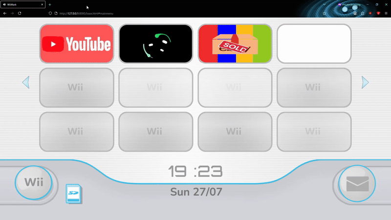

# WiiMark

WiiMark is a Wii-themed page where the TVs can be customized to open any page the user wants.

It does not require any installation as it should work off of the browser.

# How does it work?

The webapp displays channels that have been added by the user. Channels need three things to be added: a name, a link and an image. All of these are stored inside the browser's local storage.

To add a channel simply click the Wii button, where a settings menu will be shown with two options: add or delete.

The SD icon shows how much memory the channels are taking up. The message button is for documentation/instructions.

# Info for images

Recommended specs for the images is to use a very light format (like WebP) with a 19:10 ratio. Personally I use 420x220 images, then I round the corners with a radius of AT LEAST 45. Your mileage may vary.

# DISCLAIMER

This is my first real attempt at a webapp and my first use of Javascript. As such don't be surprised if the code looks REALLY bad because it is.

It started off as a very simple webapp with Flask (hence the names of the folders), since that was what I was taught, but then I decided to deviate from that because I wanted to create something that wouldn't rely on a DB or a server for storing data.

Also yes, I broke pretty much every good programming practice by putting inlay css style properties inside the html files (along with a separate style.css file), writing two billion different JS scripts, weird naming, random assets inside the static folder etc.

Some things to keep in mind: the local storage calculation that happens when clicking the SD might not be accurate (I literally copied it from some guy on StackOverflow), there are some audio related bugs (for example, sounds not playing when changing pages) and some visual bugs (like settings page not fading in).
